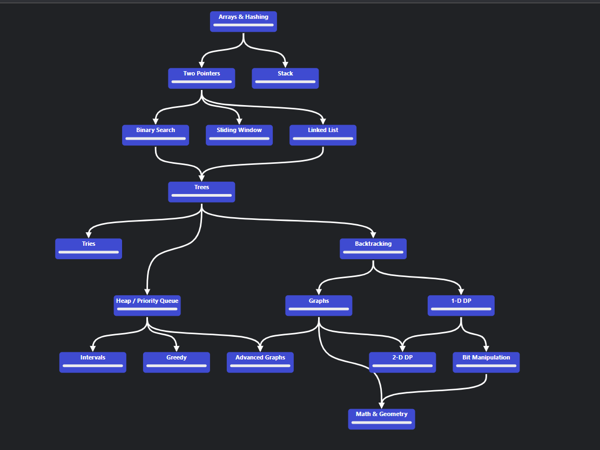

# 📘 LeetCode Problem Solving Repository

🎯 Welcome to my LeetCode Problem Solving repository!This repository is dedicated to solving LeetCode problems with well-documented, efficient solutions, focusing on clarity and best practices to help others learn and excel in coding interviews.

---
## 🚀 Overview

🎯 Goal: Solve a wide range of LeetCode problems across various topics and difficulty levels.

🧠 Approach: Provide clean, optimized solutions (primarily in Python) with detailed explanations and time/space complexity analysis.

⚙️ Tools: Python, GitHub for version control, and Markdown for clear problem documentation.

---

## 🧭 LeetCode Problem Solving Roadmap (Visual)

---

## 🧭 LeetCode Problem Solving Topics

| Topics                   | Details                                                                 |
|--------------------------|-------------------------------------------------------------------------|
| Arrays & Hashing         | Two Pointers, Stack, Binary Search, Sliding Window, Linked List         |
| Two Pointers             | Binary Search, Sliding Window                                           |
| Stack                    | Linked List                                                             |
| Binary Search            | Trees                                                                   |
| Sliding Window           | Trees                                                                   |
| Linked List              | Trees                                                                   |
| Trees                    | Tries, Heap / Priority Queue, Backtracking                              |
| Tries                    |                                                                         |
| Heap / Priority Queue    | Intervals, Greedy, Advanced Graphs                                      |
| Intervals                |                                                                         |
| Greedy                   |                                                                         |
| Advanced Graphs          |                                                                         |
| Backtracking             | Graphs, 1-D DP                                                          |
| Graphs                   | 2-D DP, Math & Geometry                                                 |
| 1-D DP                   | 2-D DP, Bit Manipulation                                                |
| 2-D DP                   | Math & Geometry                                                         |
| Bit Manipulation         |                                                                         |
| Math & Geometry          |                                                                         |

---

## 📈 GitHub Stats & Automation

This repo uses **GitHub Actions** to auto-update problem and last-update badges every day.

---

## 🙌 Let's Connect

Feel free to:

* ⭐ Star this repo
* 🛠️ Fork and contribute
* 💬 Connect on [GitHub](https://github.com/Laudarisd) or [LeetCode](https://leetcode.com/u/dbBO1xrtst/)

Happy coding! 🚀

